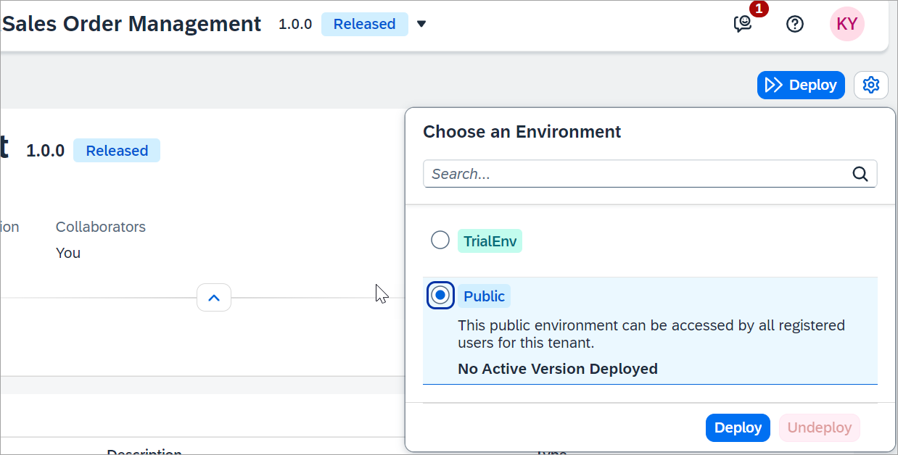

# Run the Business Process with Vertical Layout Process Editor Experience 
<!-- description --> Release, deploy and run the business process

## Prerequisites
- Complete [Create a Process Condition](spa-vl-create-process-condition) tutorial

## You will learn
  - How to release and deploy the process
  - How to run the process
  - How to monitor the process
  - How to access the tasks

---

### Release business process project

To run the process you have to first release and then deploy the business process project.

Releasing a project creates a version or snapshot of the changes and deploying the project makes it available in runtime to be consumed. You can only deploy a released version of the project, and at a given time there can be multiple deployed versions of the same project.

1. In the Process Builder, to release a project, choose the **Release** button on the top-right corner of the screen and provide a description.

    <!-- border -->

    > Version have x.y.z format where x is a major version number, y is minor and z is the patch number. Every time you release, a new version will be created. Version is incremented automatically based on how you want to store the changes in the repository like major or minor update or just as a patch.

2. If you are releasing for the first time, then the version will start with 1.0.0. Next time you release, the version numbers will be automatically updated.

    <!-- border -->

### Deploy released project

1. Once the project is released successfully, you will find a **Deploy** option on the top-right corner of the screen.

    <!-- border -->

    

2. Choose the environment and select **Deploy**
    <!-- border -->

    > Deploy will take a couple of seconds/minutes depending upon how big your project is and how many different artifacts it has. Any errors during the deployment will be shown in the Design Console.

3. Once the deployment is successful, you will see a changed status. You can also see all your deployed and/or released project versions from the project status list next to the project name.

    <!-- border -->

    > You cannot edit released or deployed projects. To continue working on your project, you need to select the Editable option.

    You have successfully deployed your project. It is time to run the process and see the results.

### Run business process

1. Open the process builder of the deployed version, and choose **Order Processing Form** to get the form URL which can be directly opened from the web browser.

    <!-- border -->

2. When you open the form in the browser, you will have all the input fields as you have defined in the process trigger form. Fill the form and choose **Submit**.

    <!-- border -->

3. After you select the submit button, you will be notified that the form has been successfully submitted. This means that the workflow has been triggered and the approval process has started.

    <!-- border -->

### Monitoring the process flow

Monitoring business process is one of the key aspect of the automated processes. Technical monitoring is an administrator job where a process admin proactively and consistently monitors the process performance, identifies any issues in the process and takes necessary actions to ensure business process continuity.

**SAP Build** provides different applications to monitor and manage different process artifacts. These applications are available under the **Monitor** tab.

1. Choose Home.

    <!-- border -->

2. Choose Monitoring.

    <!-- border -->

3. All deployed processes can be accessed under Processes and Workflows under Manage. To monitor all the running instances of the process, you have to go to Monitor then **Process and Workflow Instances**.

    <!-- border -->

    In there, you will see all the running, erroneous and canceled process instances. Use the filter bar to get a more customized view of the process instances based on different statutes like running, completed, canceled, erroneous etc.

4. Choose your process instance that was just triggered via the start form.
   
5.  As you can see the process is waiting for the task to be completed. These tasks are generated from the forms that are added in the process and can be accessed via the **My Inbox** application. In logs, you can see the entire trace of how the process has been progressing with some basic runtime information of each activity.

    <!-- border -->

    > Notice the **Recipients** list. This is the same as configured in the **General** section of the **Approval Form**. The task will go into the inboxes of all the recipients.

6. Observe the process context which is the actual process data flowing across different activities in the process. This option contains the information that you entered in the **Order Approval Request Form**.

    <!-- border -->

### Accessing the tasks

1. Choose the **My Inbox** icon from the lobby.

    <!-- border -->

2. Tasks are the request for the users to participate in an approval or review process. These tasks appear in the **My Inbox** application shipped with **SAP Build**. User can claim, approve and reject the task from their inbox.

    <!-- border -->

3. Once you **approve/reject** the approval task, **refresh** the inbox again to get the final notification based on action taken. Once you acknowledge the notification sent via the approval process, the process will be completed.

    <!-- border -->

---
